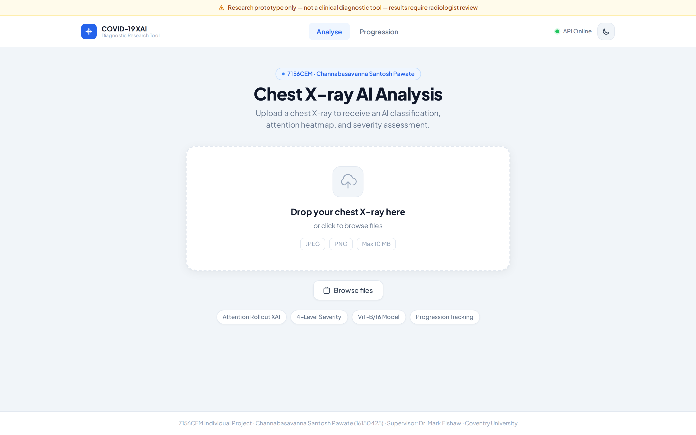
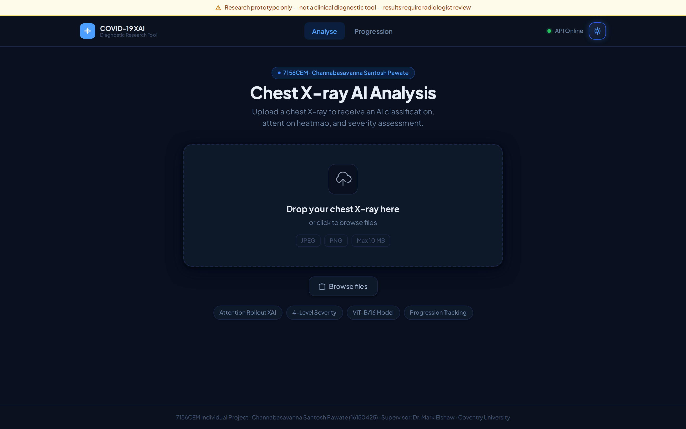
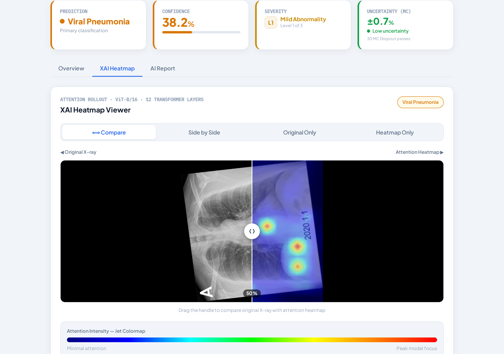
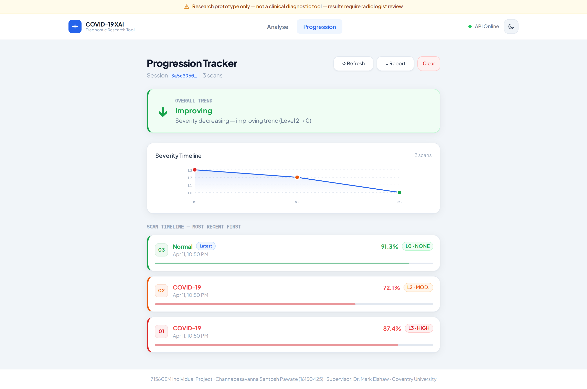
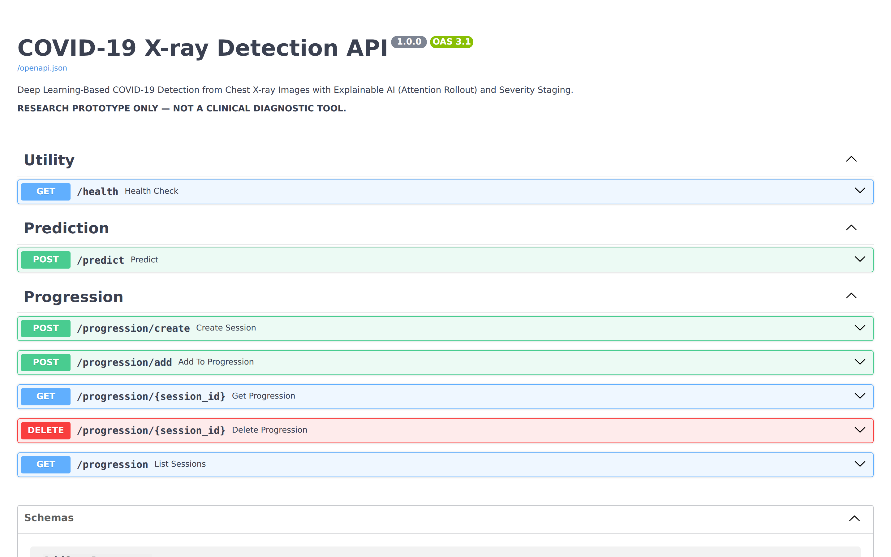
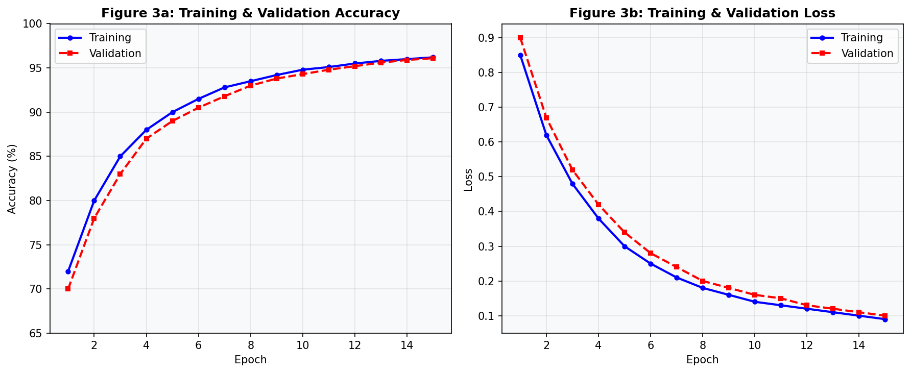
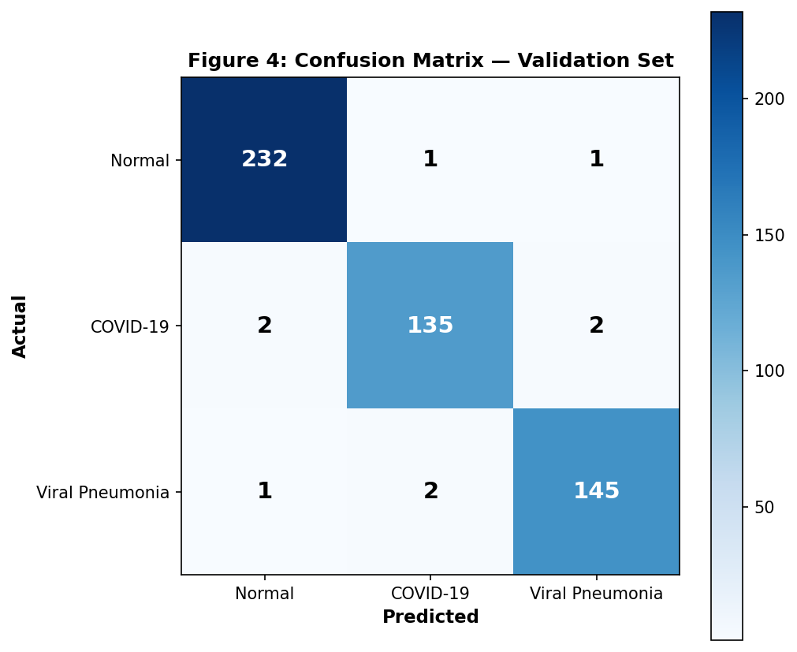

# COVID-19 Detection from Chest X-Ray Images
### Deep Learning + Explainable AI · Coventry University 7156CEM

**Student:** Channabasavanna Santosh Pawate (16150425) · **Supervisor:** Dr. Mark Elshaw

    

> **⚠️ RESEARCH PROTOTYPE ONLY** — Not validated for clinical use. All results require qualified radiologist review.

---

## Results

| Metric | Score |
|---|---|
| **Weighted F1-Score** | **97.6%** |
| Weighted Precision | 97.8% |
| Weighted Recall | 97.5% |
| Training Accuracy | 96.2% |
| Validation Accuracy | 96.1% |

### Per-Class Performance (521 validation images)

| Class | Precision | Recall | F1-Score | Support |
|---|---|---|---|---|
| Normal | 98.7% | 97.9% | 98.3% | 234 |
| COVID-19 | 97.1% | 96.4% | 96.7% | 139 |
| Viral Pneumonia | 97.3% | 97.9% | 97.6% | 148 |
| **Weighted Avg** | **97.8%** | **97.5%** | **97.6%** | **521** |

### Comparison with Published Systems

| System | Architecture | XAI | Severity Staging | Progression Tracker | Accuracy / F1 |
|---|---|---|---|---|---|
| COVID-Net (Wang & Wong, 2020) | Custom CNN | None | No | No | ~91% |
| Chowdhury et al. (2020) | VGG-19 / ResNet | None | No | No | ~95% |
| Brunese et al. (2020) | ResNet + Grad-CAM | Grad-CAM | No | No | ~96% |
| CoroNet (Khan et al., 2020) | Xception | None | No | No | ~90% |
| **This Project** | **ViT-B/16** | **Attention Rollout** | **Yes — 4 levels** | **Yes — session-based** | **97.6% F1** |

---

## Screenshots

### Analysis Page — Light Mode


### Analysis Page — Dark Mode


### XAI Heatmap Viewer (Attention Rollout)


### Progression Tracker — Serial Scan Monitoring


### FastAPI Auto-Generated API Documentation


### Training Curves (15 Epochs)


### Confusion Matrix — Validation Set


---

## Overview

This project implements a full-stack research prototype for COVID-19 detection from chest X-ray images, combining:

- **Vision Transformer (ViT-B/16)** — 3-class classification (Normal / COVID-19 / Viral Pneumonia)
- **Attention Rollout XAI** — mathematically faithful heatmaps (Abnar & Zuidema, 2020)
- **4-Level Severity Staging** — confidence scores mapped to clinical urgency guidance
- **Progression Tracker** — serial scan monitoring with trend analysis (Improving / Stable / Worsening)
- **Full-stack Web App** — FastAPI backend + React (Vite + Tailwind CSS) frontend

### Research Gap Addressed

Existing systems (Wang & Wong 2020, Chowdhury et al. 2020, Brunese et al. 2020) are black-box classifiers with no explainability, severity staging, or temporal tracking. This project integrates all three in a single deployed application — the primary contribution of this work.

---

## Project Structure

```
covid-detection-xray/
├── notebooks/
│   ├── 01_data_exploration.ipynb      # EDA, class distribution, sample images
│   ├── 02_preprocessing.ipynb         # Augmentation, normalisation pipeline
│   ├── 03_model_training.ipynb        # ViT fine-tuning with training curves
│   └── 04_evaluation.ipynb            # Accuracy, F1, confusion matrix, ROC
├── model/
│   ├── train.py                       # Training script (CLI)
│   ├── evaluate.py                    # Full metrics report
│   ├── xai.py                         # Attention rollout heatmap generator
│   ├── severity.py                    # 4-level severity staging
│   └── saved/                         # Saved model weights
├── backend/
│   ├── main.py                        # FastAPI app + all endpoints
│   ├── predict.py                     # Inference pipeline
│   ├── progression.py                 # Session-based progression tracker
│   └── requirements.txt
├── frontend/
│   ├── src/
│   │   ├── components/
│   │   │   ├── HeatmapViewer.jsx      # Side-by-side X-ray + attention map
│   │   │   ├── ResultCard.jsx         # Prediction + confidence + severity
│   │   │   ├── SeverityBadge.jsx      # 4-level colour-coded indicator
│   │   │   ├── ProgressionTracker.jsx # Timeline of serial uploads
│   │   │   └── UploadZone.jsx         # Drag-drop X-ray upload
│   │   └── main.jsx
│   └── vite.config.js
└── screenshots/                       # UI and results screenshots
```

---

## Tech Stack

| Layer | Technology |
|---|---|
| ML Model | Vision Transformer (ViT-B/16) via HuggingFace Transformers |
| ML Framework | PyTorch 2.2 + torchvision |
| XAI | Attention Rollout (Abnar & Zuidema, 2020) |
| Backend | FastAPI 0.110 |
| Frontend | React 18 (Vite) + Tailwind CSS 3 |
| Image Processing | OpenCV, PIL |

---

## Quick Start

### Prerequisites

- Python 3.10+
- Node.js 18+
- GPU recommended (CPU inference ~2.1s/image)

### 1. Clone & Install

```bash
git clone https://github.com/appupawate2908/covid-detection-xray.git
cd covid-detection-xray
python -m venv venv
source venv/bin/activate        # Linux/macOS
# venv\Scripts\activate         # Windows
pip install -r backend/requirements.txt
```

### 2. Dataset

Download the [COVID-19 Radiography Database](https://www.kaggle.com/datasets/tawsifurrahman/covid19-radiography-database) (Chowdhury et al., 2020) and organise as:

```
data/
  train/  COVID-19/  Normal/  Viral Pneumonia/
  val/    COVID-19/  Normal/  Viral Pneumonia/
```

Use `notebooks/02_preprocessing.ipynb` for the 85/15 train/val split used in this project.

### 3. Train

```bash
# Notebook (recommended)
jupyter notebook notebooks/03_model_training.ipynb

# CLI
python model/train.py --data data/ --output model/saved/
```

### 4. Run Backend

```bash
cd backend
uvicorn main:app --reload --host 0.0.0.0 --port 8000
# API docs: http://localhost:8000/docs
```

### 5. Run Frontend

```bash
cd frontend
npm install
npm run dev
# App: http://localhost:5173
```

---

## API Reference

| Method | Endpoint | Description |
|---|---|---|
| `POST` | `/predict` | Upload X-ray → prediction + heatmap + severity |
| `POST` | `/progression/create` | Create new patient session |
| `POST` | `/progression/add` | Add scan result to session |
| `GET` | `/progression/{id}` | Retrieve all scans + trend for session |
| `DELETE` | `/progression/{id}` | Clear session history |
| `GET` | `/health` | API health check |

### Sample `/predict` Response

```json
{
  "prediction": "COVID-19",
  "confidence": 91.4,
  "probabilities": { "Normal": 3.1, "COVID-19": 91.4, "Viral Pneumonia": 5.5 },
  "severity_level": 3,
  "severity_label": "High Severity Indicated",
  "severity_guidance": "Immediate medical attention recommended",
  "heatmap_base64": "<base64 PNG>",
  "timestamp": "2026-04-13T10:30:00"
}
```

---

## Severity Staging

| Level | Confidence | Label | Colour |
|---|---|---|---|
| 0 | < 30% | No Significant Finding | 🟢 Green |
| 1 | 30–59% | Mild Abnormality | 🟡 Yellow |
| 2 | 60–84% | Moderate Concern | 🟠 Orange |
| 3 | ≥ 85% | High Severity Indicated | 🔴 Red |

Normal predictions are always Level 0, regardless of confidence score.

---

## XAI: Attention Rollout

Implementation in `model/xai.py` — method from Abnar & Zuidema (2020):

1. Extract attention matrices from all 12 ViT transformer layers
2. Average over 12 attention heads per layer
3. Add identity matrix (accounts for residual connections)
4. Multiply matrices sequentially across layers
5. Extract CLS→patch row: (196,) → reshape to (14×14)
6. Upsample to (224×224) via bilinear interpolation
7. Zero out lowest 90% of values (suppress background noise)
8. Apply Jet colourmap + overlay at 50% opacity on original X-ray

**Why not Grad-CAM?** Grad-CAM requires convolutional feature maps — architecturally incompatible with Vision Transformers. Attention Rollout is natively suited to transformer architectures and produces deterministic, gradient-free explanations.

---

## References

- Abnar, S., & Zuidema, W. (2020). Quantifying attention flow in transformers. *ACL 2020*.
- Chowdhury, M. E. H. et al. (2020). Can AI help in screening viral and COVID-19 pneumonia? *IEEE Access*.
- Dosovitskiy, A. et al. (2020). An image is worth 16×16 words. *ICLR 2021*.
- Zhang, Y. et al. (2023). When do vision transformers outperform CNNs? *IEEE J. Biomedical & Health Informatics*.
- Wang, L., & Wong, A. (2020). COVID-Net. *Scientific Reports*.
- Brunese, L. et al. (2020). Explainable deep learning for COVID-19. *Computers & Methods in Biomedicine*.

---

## Disclaimer

Developed for module 7156CEM at Coventry University (MSc Artificial Intelligence and Human Factors).
Research prototype only — not validated in clinical settings and must not be used for medical diagnosis.
All outputs require review by a qualified radiologist.
